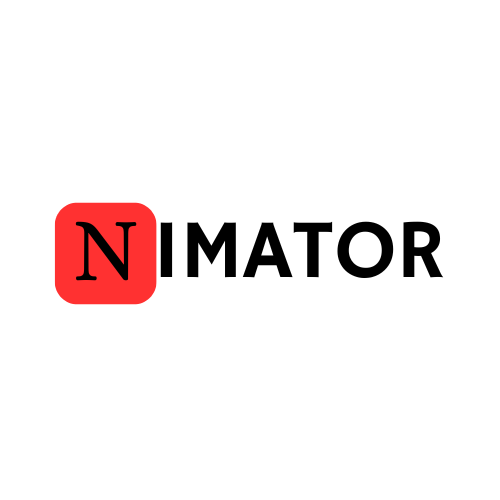
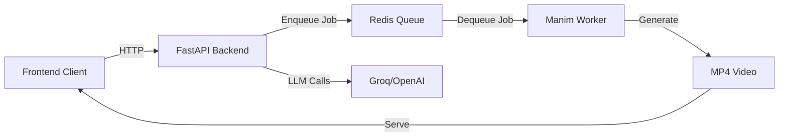
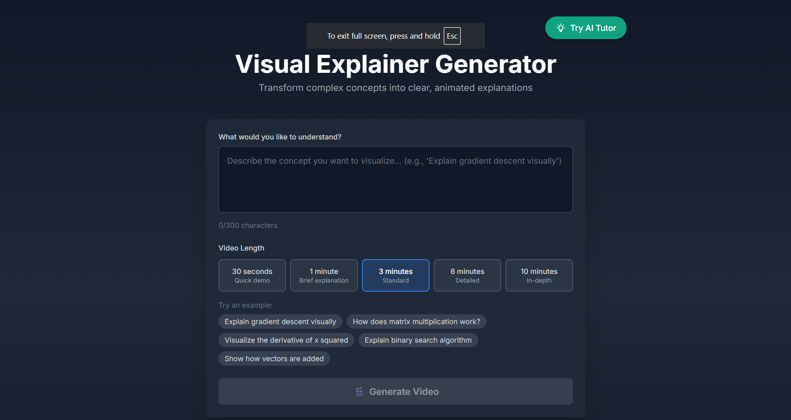
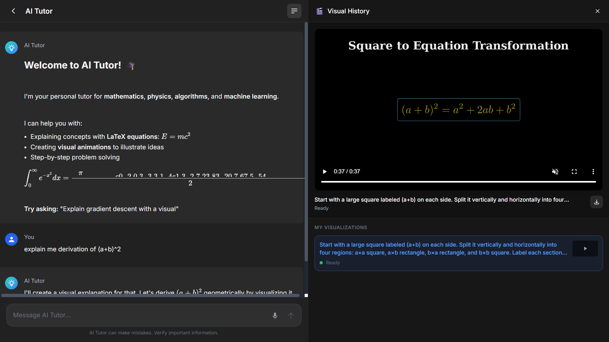

<div align="center">
  

  # Nimator
  
  **Transform Text into Math & Physics Animations Instantly**
  
  <p align="center">
    <a href="https://nextjs.org">
      
    </a>
    <a href="https://fastapi.tiangolo.com">
      
    </a>
    <a href="https://www.python.org/">
      
    </a>
    <a href="https://www.manim.community/">
      
    </a>
  </p>

  [](https://opensource.org/licenses/MIT)
  [](https://docker.com)
  [](https://github.com/psf/black)
  [](https://github.com/prettier/prettier)

  <p align="center">
    <a href="#-demo">Demo</a> •
    <a href="#-features">Features</a> •
    <a href="#-tech-stack">Tech Stack</a> •
    <a href="#-getting-started">Getting Started</a> •
    <a href="#-architecture">Architecture</a>
  </p>
</div>

---

## 💡 Overview

**Nimator** (formerly Visual Explainer Generator) is a cutting-edge educational tool that democratizes high-quality animated explanations. By bridging **Large Language Models (LLMs)** with the **Manim** animation engine, Nimator converts simple natural language queries into professional, mathematically accurate video explanations in seconds.

Whether you're a student struggling with Calculus or a developer revising Algorithms, Nimator visualizes the abstract.

## 📺 Demo

<div align="center">
  
</div>

<br />

## ✨ Features

| Feature | Description |
| :--- | :--- |
| 🗣️ **Natural Language Input** | Simply type "Explain Gradient Descent" and watch the magic happen. |
| 🎬 **Auto-Generated Scripts** | LLMs craft the educational narrative and Python code for animations simultaneously. |
| 🖌️ **Visual-First Learning** | Uses **Manim** to render vector-quality graphs, mathematical proofs, and physics simulations. |
| 🎙️ **AI Voiceover** | Integrated Text-to-Speech (TTS) narrating every step of the explanation. |
| ⚡ **Real-time Processing** | Asynchronous job queues with Redis ensure smooth handling of multiple requests. |
| 📦 **Dockerized** | One-command deployment for the entire stack. |

## � Tech Stack

### Frontend


### Backend & AI


### Infrastructure


## 🚀 Getting Started

Follow these steps to set up the project locally.

### Prerequisites
- **Docker** & **Docker Compose** installed.
- (Optional) **Groq API Key** for LLM capabilities.

### Installation

1. **Clone the repository**
   ```bash
   git clone https://github.com/pavank-code/Nimator.git
   cd Nimator
   ```

2. **Configure Environment**
   ```bash
   cp .env.example .env
   # Edit .env and allow adding your GROQ_API_KEY if you have one
   ```

3. **Run with Docker** (Recommended)
   ```bash
   docker-compose up --build
   ```

   > ⏳ **Note**: The first build might take a few minutes as it pulls the Manim docker image and installs dependencies.

4. **Access the Application**
   - 🖥️ **Frontend**: [http://localhost:3000](http://localhost:3000)
   - ⚙️ **Backend API**: [http://localhost:8000/docs](http://localhost:8000/docs)

## 🏗 Architecture

The system follows a microservices architecture to separate the heavy rendering logic from the user-facing application.



1.  **Job Queue System**: Redis manages the workload, preventing server crashes during heavy rendering tasks.
2.  **Stateless API**: FastAPI ensures scalablity.
3.  **Isolated Renderer**: The rendering engine runs in its own container with all system dependencies (LaTeX, FFmpeg) pre-packaged.

## � Screenshots

<div align="center">
  <table>
    <tr>
      <td align="center">
        <b>Generation Interface</b><br>
        
      </td>
      <td align="center">
        <b>Processing & Result</b><br>
        
      </td>
    </tr>
  </table>
</div>

## 🎯 Supported Topics

Our model performs best with:
- ✅ **Calculus** (Derivatives, Integrals)
- ✅ **Linear Algebra** (Vectors, Matrices)
- ✅ **sorting Algorithms** (Bubble Sort, Merge Sort)
- ✅ **Physics Mechanics** (Projectile Motion, Forces)

## 🤝 Contributing

Contributions are what make the open source community such an amazing place to learn, inspire, and create. Any contributions you make are **greatly appreciated**.

1. Fork the Project
2. Create your Feature Branch (`git checkout -b feature/AmazingFeature`)
3. Commit your Changes (`git commit -m 'Add some AmazingFeature'`)
4. Push to the Branch (`git push origin feature/AmazingFeature`)
5. Open a Pull Request

## 📄 License

Distributed under the MIT License. See `LICENSE` for more information.

---

<div align="center">
  <sub>Built with ❤️ by the Nimator Team</sub>
</div>
